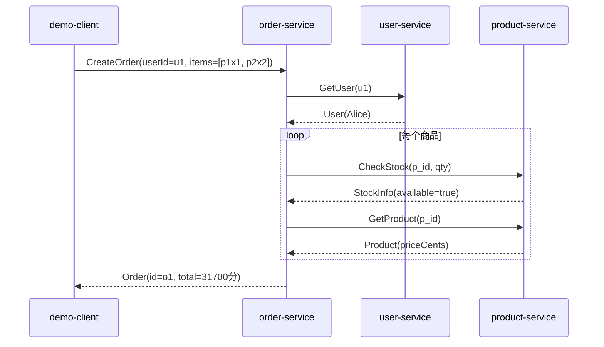

# gRPC 从零到服务间调用：一步步讲解

> 本文档配合 `LearnGrpc` 项目食用。项目里有三个微服务（user / product / order），
> 通过 `order-service` 作为“既是服务端、又是客户端”的枢纽，演示 gRPC 的完整流程与服务间调用。
> 建议一边读一边对照源码，每个文件都在仓库里。

---

## 0. 这份文档能帮你搞懂什么

读完你应当能回答：

1. gRPC 到底是什么？一次调用从客户端到服务端经历了什么？
2. `.proto` 怎么写？四种 RPC 方法长什么样、各怎么实现？
3. 代码是怎么从 `.proto` 生成出来的？生成了哪些东西？
4. 服务端怎么起、怎么关？拦截器是干嘛的、怎么串？
5. 错误怎么用状态码传递？超时怎么沿调用链传播？
6. **一个服务怎么在处理请求时去调用另一个服务？**（服务间调用）
7. 官方 best practice 落地到代码里长什么样？

---

## 1. gRPC 是什么：先建立心智模型

gRPC 是 Google 开源的、基于 **HTTP/2** 和 **Protocol Buffers** 的 RPC 框架。一句话：**让你像调用本地函数一样调用远程服务**。

四个关键词：

| 概念 | 作用 |
|------|------|
| **Protocol Buffers (protobuf)** | 接口定义语言 (IDL) + 二进制序列化格式。先用 `.proto` 描述服务和消息，再生成各语言代码 |
| **HTTP/2** | 传输层。支持多路复用、二进制分帧，一条连接上可并发多个请求、可双向流 |
| **Stub / Channel** | 客户端拿到的“代理对象”，调它的方法 = 发一次网络请求；Channel 是底层连接，可复用 |
| **四种 RPC 类型** | 一元 (Unary)、服务端流、客户端流、双向流 |

一次 **Unary** 调用的简化流程：

```
client.Call(args)
   │  1. 用 protobuf 把 args 序列化成二进制
   │  2. 装进 HTTP/2 帧，带上方法名/路径发出去
   ▼
network (HTTP/2)
   ▼
server 收到 → 按 method 路由到 handler
   │  3. 反序列化出 args，执行业务
   │  4. 把返回值序列化，发回
   ▼
client 收到 → 反序列化出返回值，Call() return
```

跟 REST/JSON 比的好处：强类型契约、更小的二进制体积、双向流、自动生成代码、跨语言。

---

## 2. 项目整体设计

三个服务，一个演示客户端：

```
                ┌──────────────┐
                │  demo-client │  (gRPC 客户端)
                └──────┬───────┘
                       │ CreateOrder / GetOrder / StreamOrderUpdates
                       ▼
                ┌──────────────┐
                │ order-service│ :50053  ← 对外是服务端，对下游是客户端
                └───┬──────┬───┘
        GetUser │      │ CheckStock / GetProduct
                    ▼        ▼
        ┌──────────────┐  ┌─────────────────┐
        │ user-service │  │ product-service │
        │    :50051    │  │     :50052      │
        └──────────────┘  └─────────────────┘
```

`order-service` 是核心：收到 `CreateOrder` 后，它会 **作为 gRPC 客户端** 去调 `user-service` 校验用户、调 `product-service` 校验库存并取真实价格。这就是“服务间调用”。

每种 RPC 类型在项目里都有体现：

| 类型 | 在哪演示 | 方法 |
|------|----------|------|
| 一元 Unary | 到处都是 | `GetUser` / `CheckStock` / `CreateOrder` / `GetOrder` |
| 服务端流 | user / product | `ListUsers` / `ListProducts` |
| 客户端流 | product | `AdjustStock` |
| 双向流 | order | `StreamOrderUpdates` |

目录结构：

```
proto/            # .proto 接口定义
gen/              # protoc 生成的代码（不要手改）
internal/
  server/         # 服务端启动 + 优雅关闭骨架
  interceptor/    # 日志 / panic 恢复 / 鉴权 拦截器
  client/         # 客户端拨号助手
  errs/           # gRPC 状态错误封装
services/         # 三个服务的业务实现
cmd/              # 程序入口（user/product/order-service, demo-client）
docs/guide.md     # 就是本文
```

---

## 3. 第一步：用 proto 定义接口（IDL）

先看 `proto/user/v1/user.proto`（精简版）：

```protobuf
syntax = "proto3";                       // 用 proto3 语法

package learngrpc.user.v1;               // 逻辑包名，避免命名冲突

option go_package = "learngrpc/gen/user/v1;userv1";
//   └─ 生成 Go 代码时的 import 路径；分号后是 Go 包名

service UserService {                    // 定义一个服务
  rpc CreateUser(CreateUserRequest) returns (User);           // 一元
  rpc GetUser(GetUserRequest) returns (User);                 // 一元
  rpc ListUsers(ListUsersRequest) returns (stream User);      // 服务端流
}

message User { string id = 1; string name = 2; string email = 3; int64 created_at = 4; }
message CreateUserRequest { string name = 1; string email = 2; }
message GetUserRequest { string id = 1; }
message ListUsersRequest { int32 page_size = 1; }
```

要点：

- `syntax = "proto3"`：字段默认值、不能显式设默认值等规则都由它决定。
- **字段编号**（`= 1`）是字段在二进制里的标识，**一旦发布就不能改**（兼容性靠它）。
- `stream` 关键字决定 RPC 类型：
  - 没有 stream → 一元
  - `returns (stream X)` → 服务端流
  - `请求是 stream` → 客户端流
  - 两边都 stream → 双向流

四种写法对照（取自本项目）：

```protobuf
rpc GetUser(GetUserRequest) returns (User);                         // 一元
rpc ListUsers(ListUsersRequest) returns (stream User);              // 服务端流
rpc AdjustStock(stream StockAdjustment) returns (AdjustStockSummary); // 客户端流
rpc StreamOrderUpdates(stream OrderQuery) returns (stream OrderUpdate); // 双向流
```

`go_package` 很关键：它决定生成代码的 Go import 路径。本项目统一生成到 `learngrpc/gen/<服务>/v1`。

---

## 4. 第二步：生成 Go 代码

用 `protoc` 生成（见 `Makefile` 的 `proto` 目标）：

```bash
protoc --proto_path=proto \
  --go_out=.        --go_opt=module=learngrpc \
  --go-grpc_out=.   --go-grpc_opt=module=learngrpc \
  proto/user/v1/user.proto proto/product/v1/product.proto proto/order/v1/order.proto
```

参数逐个解释：

- `--proto_path=proto`：去 `proto/` 目录下找 `.proto` 文件。
- `--go_out=.`：消息（message）代码生成到当前目录。
- `--go_opt=module=learngrpc`：**剥掉** go_package 里的 `learngrpc/` 前缀，这样输出路径变成 `gen/user/v1/user.pb.go` 而不是重复前缀。
- `--go-grpc_out=. --go-grpc_opt=module=learngrpc`：服务（service）代码同理。

生成两个文件（以 user 为例）：

| 文件 | 内容 |
|------|------|
| `gen/user/v1/user.pb.go` | `User`、`CreateUserRequest` 等消息的 Go 结构体 + 序列化方法 + getter |
| `gen/user/v1/user_grpc.pb.go` | `UserServiceServer` 接口、`RegisterUserServiceServer`、客户端 `UserServiceClient` |

**`UnimplementedUserServiceServer` 是什么？**

生成代码里会有一个 `_ = userv1.UnimplementedUserServiceServer{}` 的嵌入。它给所有方法提供了一个“返回未实现”的默认实现。你只要把 `UnimplementedUserServiceServer` 嵌进自己的 struct，就**只需实现关心的方法**，没实现的方法调用时会得到 `Unimplemented` 错误，而不是编译报错。这也是向后兼容的护城河：proto 加了新方法，老的服务实现不会编译失败。

---

## 5. 第三步：搭服务端通用骨架（`internal/server/server.go`）

三个服务的启动逻辑几乎一样，所以抽到 `server.Run`：

```go
func Run(ctx context.Context, cfg Config) error {
    lis, err := net.Listen("tcp", cfg.Addr)        // 1. 监听端口
    if err != nil { return err }

    srv := grpc.NewServer(cfg.ServerOpts...)        // 2. 建 server（拦截器在这里传进去）
    cfg.Register(srv)                               // 3. 注册业务实现

    go srv.Serve(lis)                               // 4. 开始接受连接

    // 5. 监听 SIGINT/SIGTERM，收到就 GracefulStop
    ctx, stop := signal.NotifyContext(ctx, syscall.SIGINT, syscall.SIGTERM)
    defer stop()
    select {
    case <-ctx.Done():
        // GracefulStop 等已开始的请求处理完再退出；超时则强制 Stop
    }
}
```

**为什么要优雅关闭？**

`Stop()` 会立刻断开所有连接，正在处理的请求会被掐断；`GracefulStop()` 会等在途请求处理完。线上发版时用优雅关闭，能避免“半截请求”造成数据不一致。本项目还加了超时兜底：等太久就强杀，防止卡死。

一个服务入口（`cmd/user-service/main.go`）就这么简洁：

```go
server.Run(context.Background(), server.Config{
    Name: "user-service",
    Addr: server.EnvOr("USER_SERVICE_ADDR", ":50051"),
    Register: func(s *grpc.Server) {
        userv1.RegisterUserServiceServer(s, user.New())
    },
    ServerOpts: []grpc.ServerOption{
        grpc.ChainUnaryInterceptor(interceptor.UnaryRecovery(logger), interceptor.UnaryLogging(logger)),
        grpc.ChainStreamInterceptor(interceptor.StreamRecovery(logger), interceptor.StreamLogging(logger)),
    },
})
```

---

## 6. 第四步：拦截器（gRPC 的中间件）

拦截器让你在“真正执行业务方法”前后插逻辑，类似 HTTP 里的中间件。分两套：

- `UnaryServerInterceptor`：拦截一元调用
- `StreamServerInterceptor`：拦截流式调用

本项目实现了三组（`internal/interceptor/interceptor.go`）：

**① 日志**：记录方法名、状态码、耗时、来源 IP。

```go
func UnaryLogging(logger *log.Logger) grpc.UnaryServerInterceptor {
    return func(ctx context.Context, req any, info *grpc.UnaryServerInfo, handler grpc.UnaryHandler) (any, error) {
        start := time.Now()
        resp, err := handler(ctx, req)            // 调用真正的业务方法
        logger.Printf("unary %-42s code=%-7s dur=%s", info.FullMethod, status.Code(err), time.Since(start))
        return resp, err
    }
}
```

**② panic 恢复**：一个请求 panic 不该把整个进程拖垮。

```go
func UnaryRecovery(logger *log.Logger) grpc.UnaryServerInterceptor {
    return func(ctx context.Context, req any, info *grpc.UnaryServerInfo, handler grpc.UnaryHandler) (resp any, err error) {
        defer func() {
            if r := recover(); r != nil {
                logger.Printf("panic in %s: %v\n%s", info.FullMethod, r, debug.Stack())
                err = status.Error(codes.Internal, "internal error")  // 返回规范错误
            }
        }()
        return handler(ctx, req)
    }
}
```

**③ 鉴权**：从 metadata（类似 HTTP header）里读 `authorization: Bearer <token>` 校验。`order-service` 启用了它。

**串联顺序**：`grpc.ChainUnaryInterceptor(A, B, C)` 执行顺序是 `A → B → C → 业务 → C → B → A`（洋葱模型）。所以把 `Recovery` 放最外层，它才能兜住内层一切 panic。本项目 order-service 的顺序是：`Recovery → Logging → Auth → 业务`。

> 客户端也有拦截器（`internal/client/client.go`），本项目用它自动给每次调用附加鉴权 metadata。

---

## 7. 第五步：错误处理与状态码

gRPC 用 **`status` + `codes`** 表达错误，而不是普通 `error`。客户端可以用 `status.Code(err)` 拿到码做分支。

`internal/errs/errs.go` 封装了常用的：

```go
func NotFound(format string, a ...any) error        { return status.Errorf(codes.NotFound, format, a...) }
func FailedPrecondition(format string, a ...any) error { return status.Errorf(codes.FailedPrecondition, format, a...) }
// ... InvalidArgument / AlreadyExists / Internal
```

常见码：

| code | 含义 | 本项目何时用 |
|------|------|--------------|
| `OK` | 成功 | 正常返回 |
| `InvalidArgument` | 参数非法 | name/email 为空、quantity<=0 |
| `NotFound` | 资源不存在 | 用户/商品/订单查不到 |
| `AlreadyExists` | 已存在 | 重复邮箱注册 |
| `FailedPrecondition` | 前置条件不满足 | 用户不存在、库存不足 |
| `Unauthenticated` | 未鉴权 | 缺/错 token |
| `DeadlineExceeded` | 超时 | 客户端设的 deadline 到了 |
| `Internal` | 内部错误 | 下游异常、panic |

---

## 8. 第六步：实现 user-service / product-service

业务逻辑都存在内存 map 里（学习用，真实项目换数据库）。关键是看 **不同 RPC 类型怎么实现**。

**一元**：最普通，`ctx context.Context, req *X` 进，`*Y, error` 出。

```go
func (s *Service) GetUser(ctx context.Context, req *userv1.GetUserRequest) (*userv1.User, error) {
    u, ok := s.users[req.GetId()]
    if !ok { return nil, errs.NotFound("user %q not found", req.GetId()) }
    return u, nil
}
```

**服务端流**：服务端拿到一个 `stream`，循环 `stream.Send(msg)` 推消息，发完 `return nil`。

```go
func (s *Service) ListUsers(req *userv1.ListUsersRequest, stream userv1.UserService_ListUsersServer) error {
    for _, u := range s.users {
        if err := stream.Send(u); err != nil { return err }   // 客户端可能中途断开
    }
    return nil   // 返回 nil = 正常结束流
}
```

**客户端流**：客户端连续发，服务端循环 `stream.Recv()` 收；`io.EOF` 表示客户端发完了，这时用 `stream.SendAndClose(summary)` 返回唯一一个汇总。

```go
func (s *Service) AdjustStock(stream productv1.ProductService_AdjustStockServer) error {
    for {
        adj, err := stream.Recv()
        if err == io.EOF { return stream.SendAndClose(&productv1.AdjustStockSummary{Processed: n, Ok: true}) }
        if err != nil { return err }
        // 改库存 ...
    }
}
```

---

## 9. 第七步：order-service —— 服务间调用核心（重点）

这是整个项目的灵魂。`order-service` **既是服务端**（实现 `OrderServiceServer`），**又是客户端**（持有 `UserServiceClient`、`ProductServiceClient` 去调下游）。

### 9.1 既是服务端又是客户端

启动时（`cmd/order-service/main.go`）先拨号连接两个下游：

```go
userConn, _    := client.Dial("localhost:50051", "")   // 内部调用不带 token
productConn, _ := client.Dial("localhost:50052", "")
clients := order.Clients{
    User:    userv1.NewUserServiceClient(userConn),
    Product: productv1.NewProductServiceClient(productConn),
}
orderv1.RegisterOrderServiceServer(s, order.New(clients))   // 把下游客户端注入实现
```

> `*grpc.ClientConn` 是昂贵且线程安全的，**只建一次、长期复用**，不要每次请求新建。本项目在 main 里建好传进去。

### 9.2 CreateOrder 的调用链

`CreateOrder` 收到请求后，先校验用户、再逐个校验库存并取真实价格（防止客户端伪造价格），最后生成订单：

```go
func (s *Service) CreateOrder(ctx context.Context, req *orderv1.CreateOrderRequest) (*orderv1.Order, error) {
    // 1) 跨服务校验用户
    if _, err := s.clients.User.GetUser(ctx, &userv1.GetUserRequest{Id: req.GetUserId()}); err != nil {
        if status.Code(err) == codes.NotFound {
            return nil, errs.FailedPrecondition("user %q does not exist", req.GetUserId())
        }
        return nil, errs.Internal(fmt.Errorf("user-service: %w", err))
    }
    // 2)+3) 逐个校验库存 + 取真实价格
    for _, it := range req.GetItems() {
        stock, err := s.clients.Product.CheckStock(ctx, &productv1.CheckStockRequest{...})
        if !stock.GetAvailable() { return nil, errs.FailedPrecondition("insufficient stock...") }
        prod, err := s.clients.Product.GetProduct(ctx, &productv1.GetProductRequest{Id: it.GetProductId()})
        // 用 prod.PriceCents 而不是客户端传的，避免被伪造
        totalCents += prod.GetPriceCents() * int64(it.GetQuantity())
    }
    // 4) 生成订单
    return s.saveOrder(...), nil
}
```

三个值得注意的工程细节：

**① context 传播 = 超时传播**：下游调用直接用入参 `ctx`。这样客户端设的 deadline 会**沿调用链一路传到 user/product**。demo-client 给 `CreateOrder` 设了 3 秒超时，这 3 秒预算在 order→user、order→product 之间共享。实测把超时改成 1ms，会得到 `DeadlineExceeded`。

**② 下游错误码映射**：下游返回 `NotFound` 时，对订单业务来说语义是“前置条件不满足”，所以映射成 `FailedPrecondition` 而不是原样透传 `NotFound`（否则客户端会以为是“订单”不存在）。其它异常则包成 `Internal`。

**③ 不要信任客户端输入的价格**：价格从 `product-service` 取，不从请求里拿。

### 9.3 双向流：StreamOrderUpdates

双向流两边都是 `stream`：客户端 `Send` 发查询、`Recv` 收更新；服务端反之。

```go
func (s *Service) StreamOrderUpdates(stream orderv1.OrderService_StreamOrderUpdatesServer) error {
    for {
        q, err := stream.Recv()                 // 收一条查询
        if err == io.EOF { return nil }         // 客户端发完
        // 推送几条状态更新
        for _, t := range transitions { stream.Send(&orderv1.OrderUpdate{...}) }
    }
}
```

双向流的一个坑：**双方都可能阻塞在 Recv 上**，必须约定谁、何时关闭。本项目约定：客户端收到“已发货”后调 `CloseSend()`，服务端的 `Recv` 随即收到 `io.EOF` 结束流。

---

## 10. 服务间调用时序图

`demo-client` 调一次 `CreateOrder`，实际发生了这些事：



从运行日志能直接验证这条链路：order-service 记一条 `CreateOrder dur=8ms`，同时 user-service 记一条 `GetUser`，product-service 记了两轮 `CheckStock + GetProduct`。

---

## 11. 第八步：演示客户端（`cmd/demo-client/main.go`）

客户端把四种调用都演示了一遍，核心写法：

**一元**：

```go
o, err := orderClient.CreateOrder(ctx, &orderv1.CreateOrderRequest{UserId: "u1", Items: ...})
```

**服务端流**：`Recv` 到 `io.EOF` 表示结束。

```go
stream, _ := productClient.ListProducts(ctx, &productv1.ListProductsRequest{PageSize: 10})
for {
    p, err := stream.Recv()
    if err == io.EOF { break }
    // 用 p
}
```

**客户端流**：先 `Send` 多条，再 `CloseAndRecv` 拿汇总。

```go
stream, _ := productClient.AdjustStock(ctx)
stream.Send(&productv1.StockAdjustment{ProductId: "p1", Delta: 5})
// ... 多条
summary, _ := stream.CloseAndRecv()
```

**双向流**：`Send` 和 `Recv` 交替，约定好关闭时机。

```go
stream, _ := orderClient.StreamOrderUpdates(ctx)
stream.Send(&orderv1.OrderQuery{OrderId: id})
for {
    upd, err := stream.Recv()
    if err == io.EOF { break }
    if upd.GetStatus() == orderv1.OrderStatus_ORDER_STATUS_SHIPPED { stream.CloseSend() }
}
```

---

## 12. 最佳实践清单（对照源码）

| 实践 | 落在哪 |
|------|--------|
| 用 proto3 + `go_package` 明确包路径 | `proto/*/v1/*.proto` |
| 生成的代码单独放、不手改 | `gen/` |
| 嵌入 `UnimplementedXxxServer` 保证向后兼容 | `services/*/service.go` |
| 拦截器统一处理日志/恢复/鉴权 | `internal/interceptor` |
| 用 `status`+`codes` 规范错误，并封装 | `internal/errs` |
| `*grpc.ClientConn` 复用、不每次新建 | `cmd/order-service/main.go` |
| 用 `grpc.NewClient`（新 API，替代已废弃的 `grpc.Dial`） | `internal/client/client.go` |
| 超时/deadline 沿 ctx 传播 | `CreateOrder` 透传 `ctx` |
| 优雅关闭 `GracefulStop` + 超时兜底 | `internal/server/server.go` |
| 不信任客户端输入，价格服务端取 | `CreateOrder` 调 `GetProduct` |
| 下游错误码按业务语义映射 | `CreateOrder` 的 `status.Code` 分支 |

> 生产环境还要补：**TLS**（本项目用 insecure 仅为学习）、**健康检查 / 反射**、**负载均衡**、**链路追踪 / 指标**、**限流重试**等。

---

## 13. 如何运行 / 验证

```bash
# 一次性安装代码生成插件
go install google.golang.org/protobuf/cmd/protoc-gen-go@latest
go install google.golang.org/grpc/cmd/protoc-gen-go-grpc@latest

make tidy        # 拉依赖
make proto       # 从 proto 生成代码（改了 proto 才需要）
make build       # 编译到 bin/

# 终端方式（推荐，能分开看日志）
make run-user       # :50051
make run-product    # :50052
make run-order      # :50053
make demo           # 跑演示客户端

# 或一键后台起三个服务再跑客户端
make run-all && make demo
```

预期看到五段演示：创建订单（级联）、查订单、列商品（服务端流）、改库存（客户端流）、订单状态推送（双向流），最后 `✅ 全部演示完成`。

**验证服务间调用**：盯住三个服务的日志。`make demo` 跑 `CreateOrder` 时，`order-service` 日志里会有一条 `CreateOrder`，而 `user-service` 会同时出现一条 `GetUser`、`product-service` 会出现 `CheckStock` + `GetProduct` —— 这就是 order 在背后调了它们。

---

## 14. 常见问题与扩展

**Q：为什么用 `grpc.NewClient` 而不是 `grpc.Dial`？**
`grpc.Dial`（带 `WithBlock`/`WithTimeout`）已废弃。`NewClient` 默认懒连接，首次 RPC 才真正建连，更符合现代用法。代价是：连不上要到第一次调用才报错。

**Q：insecure 安全吗？**
不安全，仅用于本地学习。生产要换 `credentials.NewTLS(...)`，内部服务间可用 mTLS。

**Q：proto 加了字段会不兼容吗？**
加字段兼容（老客户端忽略新字段）。删字段、改字段编号、改类型才可能不兼容。编号永远不要复用。

**Q：怎么调试 gRPC？**
用 `grpcurl`（需要服务开了反射）或本项目自带的 `demo-client`。

**可以接着练的方向：**
1. 给服务加 gRPC 健康检查（`grpc_health_v1`）和 server reflection。
2. 把 insecure 换成 TLS。
3. 加一个拦截器实现“按方法限流”或“调用计数指标”。
4. 让 `order-service` 对下游调用加重试（注意幂等）。
5. 用 `buf` 替代手写 protoc 命令管理 proto。

---

> 想深入官方资料：gRPC 官方文档 <https://grpc.io/docs/> 、Protocol Buffers 语言指南 <https://protobuf.dev/programming-guides/proto3/> 。
